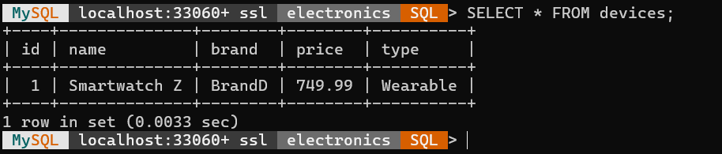

# Реалізація об’єктно-реляційного відображення (DAO)

## 1. Створення бази даних MySQL

Було створено базу даних `electronics` у MySQL для зберігання даних.

```sql
CREATE DATABASE IF NOT EXISTS electronics;
USE electronics;

CREATE TABLE IF NOT EXISTS devices (
  id INT PRIMARY KEY AUTO_INCREMENT,
  name VARCHAR(100) NOT NULL,
  brand VARCHAR(100),
  price DECIMAL(10,2),
  type VARCHAR(50)
);

INSERT INTO devices (name, brand, price, type) VALUES
  ('Smartphone X', 'BrandA', 699.99, 'Smartphone'),
  ('Laptop Pro',  'BrandB', 1299.49, 'Laptop'),
  ('Tablet S',    'BrandC', 499.00,  'Tablet');
```

## 2. Створення структури Java-проєкту

Створено консольний Java-проєкт без IDE. Діялі через термінал Windows або macOS.

```bash
mkdir electronics-dao-example
cd electronics-dao-example
mkdir -p sql src/model src/dao/impl src/util src/test
```

**Структура проекту:**

```
electronics-dao-example/
├── sql/                     # SQL-скрипт для БД
│   └── electronics_db.sql
├── src/
│   ├── model/               # Модель даних
│   │   └── Device.java
│   ├── dao/                 # Інтерфейс DAO
│   │   └── DeviceDAO.java
│   ├── dao/impl/            # Реалізація DAO
│   │   └── DeviceDAOImpl.java
│   ├── util/                # Підключення до БД
│   │   └── DatabaseConnection.java
│   └── test/                # Тестовий клас
│       └── TestDeviceDAO.java
└── README.md
```

## 3. Опис таблиці `devices`

| Поле  | Тип          | Опис                                    |
|-------|--------------|-----------------------------------------|
| id    | INT          | Первинний ключ, AUTO_INCREMENT          |
| name  | VARCHAR(100) | Назва пристрою                          |
| brand | VARCHAR(100) | Виробник                                |
| price | DECIMAL(10,2)| Ціна                                    |
| type  | VARCHAR(50)  | Тип пристрою                            |

## 4. Bean-клас `Device`

Файл: `src/model/Device.java`

```java
package model;

public class Device {
    private int id;
    private String name;
    private String brand;
    private double price;
    private String type;

    public Device() {}

    public Device(int id, String name, String brand, double price, String type) {
        this.id = id;
        this.name = name;
        this.brand = brand;
        this.price = price;
        this.type = type;
    }

    public int getId() { return id; }
    public String getName() { return name; }
    public String getBrand() { return brand; }
    public double getPrice() { return price; }
    public String getType() { return type; }

    public void setId(int id) { this.id = id; }
    public void setName(String name) { this.name = name; }
    public void setBrand(String brand) { this.brand = brand; }
    public void setPrice(double price) { this.price = price; }
    public void setType(String type) { this.type = type; }

    @Override
    public String toString() {
        return "Device{" +
               "id=" + id +
               ", name='" + name + ''' +
               ", brand='" + brand + ''' +
               ", price=" + price +
               ", type='" + type + ''' +
               '}';
    }
}
```

## 5. DAO-інфраструктура

### 5.1. Інтерфейс `DeviceDAO`

Файл: `src/dao/DeviceDAO.java`

```java
package dao;

import model.Device;
import java.util.List;

public interface DeviceDAO {
    List<Device> getAllDevices();
    Device getDeviceById(int id);
    void addDevice(Device device);
    void updateDevice(Device device);
    void deleteDevice(int id);
}
```

### 5.2. Реалізація `DeviceDAOImpl`

Файл: `src/dao/impl/DeviceDAOImpl.java`

```java
package dao.impl;

import dao.DeviceDAO;
import model.Device;
import util.DatabaseConnection;
import java.sql.*;
import java.util.ArrayList;
import java.util.List;

public class DeviceDAOImpl implements DeviceDAO {
    private Connection conn;

    public DeviceDAOImpl() {
        try {
            conn = DatabaseConnection.getConnection();
        } catch (SQLException e) {
            throw new RuntimeException("Не вдалося підключитися до БД", e);
        }
    }

    @Override
    public List<Device> getAllDevices() {
        List<Device> list = new ArrayList<>();
        String sql = "SELECT * FROM devices";
        try (Statement stmt = conn.createStatement();
             ResultSet rs = stmt.executeQuery(sql)) {
            while (rs.next()) {
                list.add(new Device(
                    rs.getInt("id"),
                    rs.getString("name"),
                    rs.getString("brand"),
                    rs.getDouble("price"),
                    rs.getString("type")
                ));
            }
        } catch (SQLException e) {
            e.printStackTrace();
        }
        return list;
    }

    @Override
    public Device getDeviceById(int id) {
        String sql = "SELECT * FROM devices WHERE id = ?";
        try (PreparedStatement ps = conn.prepareStatement(sql)) {
            ps.setInt(1, id);
            try (ResultSet rs = ps.executeQuery()) {
                if (rs.next()) {
                    return new Device(
                        rs.getInt("id"),
                        rs.getString("name"),
                        rs.getString("brand"),
                        rs.getDouble("price"),
                        rs.getString("type")
                    );
                }
            }
        } catch (SQLException e) {
            e.printStackTrace();
        }
        return null;
    }

    @Override
    public void addDevice(Device device) {
        String sql = "INSERT INTO devices (name, brand, price, type) VALUES (?, ?, ?, ?)";
        try (PreparedStatement ps = conn.prepareStatement(sql)) {
            ps.setString(1, device.getName());
            ps.setString(2, device.getBrand());
            ps.setDouble(3, device.getPrice());
            ps.setString(4, device.getType());
            ps.executeUpdate();
        } catch (SQLException e) {
            e.printStackTrace();
        }
    }

    @Override
    public void updateDevice(Device device) {
        String sql = "UPDATE devices SET name=?, brand=?, price=?, type=? WHERE id=?";
        try (PreparedStatement ps = conn.prepareStatement(sql)) {
            ps.setString(1, device.getName());
            ps.setString(2, device.getBrand());
            ps.setDouble(3, device.getPrice());
            ps.setString(4, device.getType());
            ps.setInt(5, device.getId());
            ps.executeUpdate();
        } catch (SQLException e) {
            e.printStackTrace();
        }
    }

    @Override
    public void deleteDevice(int id) {
        String sql = "DELETE FROM devices WHERE id = ?";
        try (PreparedStatement ps = conn.prepareStatement(sql)) {
            ps.setInt(1, id);
            ps.executeUpdate();
        } catch (SQLException e) {
            e.printStackTrace();
        }
    }
}
```

## 6. Утилітний клас `DatabaseConnection`

Файл: `src/util/DatabaseConnection.java`

```java
package util;

import java.sql.Connection;
import java.sql.DriverManager;
import java.sql.SQLException;

public class DatabaseConnection {
    private static final String URL =
        "jdbc:mysql://localhost:3306/electronics"
      + "?useSSL=false"
      + "&allowPublicKeyRetrieval=true"
      + "&serverTimezone=UTC";
    private static final String USER = "root";
    private static final String PASSWORD = "password";
    private static Connection connection;

    public static Connection getConnection() throws SQLException {
        if (connection == null || connection.isClosed()) {
            connection = DriverManager.getConnection(URL, USER, PASSWORD);
        }
        return connection;
    }
}
```

## 7. Тестування через `TestDeviceDAO`

Файл: `src/test/TestDeviceDAO.java`

```java
package test;

import dao.DeviceDAO;
import dao.impl.DeviceDAOImpl;
import model.Device;
import java.util.List;

public class TestDeviceDAO {
    public static void main(String[] args) {
        DeviceDAO dao = new DeviceDAOImpl();

        // Додати новий пристрій
        dao.addDevice(new Device(0, "Smartwatch Z", "BrandD", 199.99, "Wearable"));

        // Показати всі
        List<Device> devices = dao.getAllDevices();
        devices.forEach(System.out::println);

        // Пошук за ID
        Device device = dao.getDeviceById(1);
        System.out.println("Fetched by ID 1: " + device);

        // Оновлення ціни
        if (device != null) {
            device.setPrice(749.99);
            dao.updateDevice(device);
        }

        // Видалення за ID
        dao.deleteDevice(2);

        System.out.println("Після змін:");
        dao.getAllDevices().forEach(System.out::println);
    }
}
```

## 8. Інструкції з компіляції та запуску

```bash
# Компіляція (приклад для Linux/macOS)
javac -cp "lib/mysql-connector-j-<version>.jar" src/**/*.java

# Запуск
java -cp "lib/mysql-connector-j-<version>.jar:src" test.TestDeviceDAO
```
## Результат роботи 

 

## 9. Висновок

- Застосовано патерн **DAO** для доступу до MySQL.
- Реалізовано CRUD-операції над таблицею `devices`.
- Підтверджено роботу через тестовий клас.

